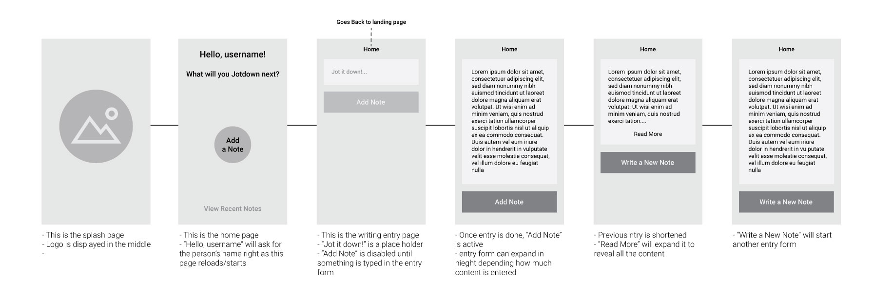

# :memo: JotIt App

This application lets participants jot down quick and easy entries. You can make it as long or as
short as you like.

## Wireframe

Initally there was suppose to be a splash page, however, for UX/UI purposes it makes more sense to
have the "welcome-page.js" to be the first page for users to see once they load the app. Less is
more!

## Current Status

### :white_check_mark: What is built

- [x] Welcome page that asks for the participant's name.
- [x] Entry page where the participant can enter their title and note.
- [x] Error Messages when name, title, and entries are not entered upon submitting those fields.

### :tractor: What needs to be built:

**Some additions for the future:**

- [ ] Date and time of note added.
- [ ] a splash page that appears for a couple of seconds and disappears once the app is loaded.
  - Then loads the welcome page.
- [ ] Add a setup account for new users.
- [ ] Add a Login and Password fields for current users.
- [ ] Have notes to be saved from previous session.
- [ ] Add a Edit and Delete buttons for each entry.

## Other Notes:

> This app is a final project for my Code Sprints A module. This course was solely focused on
> front-end programming.

This project was bootstrapped with [Create React App](https://github.com/facebook/create-react-app).
